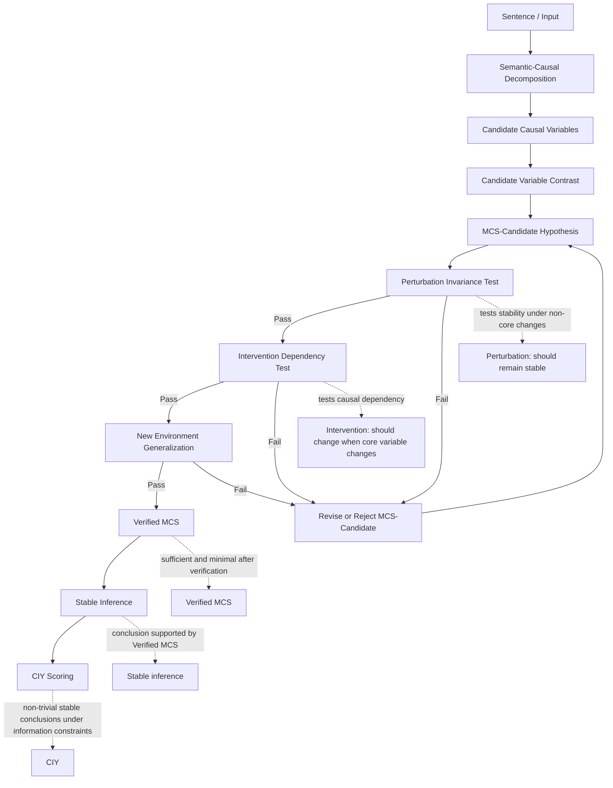

# 1.3 Stable Inference
## Stable Inference as Verified Minimal Causal Structure

---

## 1. Core Claim

Stable inference is not the initial extraction of a causal structure.

Stable inference is the verified stability of a causal hypothesis under valid perturbations, interventions, and new environments.

In this framework, a model does not demonstrate stable inference simply by producing a correct answer. A conclusion only counts as stable inference when it is supported by a causal hypothesis that remains valid under controlled variation.

The central idea is:

```text
MCS-Candidate
↓
Perturbation Invariance Test
↓
Intervention Dependency Test
↓
New Environment Generalization
↓
Verified MCS
↓
Stable Inference
↓
CIY
```

This means that stable inference is a verified property, not an assumed property.

---

## 2. Motivation

Current reasoning evaluation often treats final-answer correctness as evidence of reasoning. However, a model may produce correct answers by exploiting shortcuts, surface correlations, or environment-specific statistical patterns.

For example:

```text
The red bird can fly.
```

A model may learn:

```text
red → can fly
```

instead of:

```text
bird → can fly
```

The first rule may work in the training environment if color is spuriously correlated with the label. However, it is not a stable causal support structure if color changes do not affect the conclusion.

Therefore, stable inference requires more than output correctness. It requires identifying which semantic variables actually support the conclusion, and then verifying whether that support remains stable under perturbation, intervention, and environment shift.

---

## 3. Framework Overview

This document proposes an operational framework for stable inference based on Minimal Causal Structure verification.

It should not be interpreted as a complete theory of causal reasoning. It is an experimental and conceptual framework for evaluating whether a model's conclusions are supported by stable causal structure rather than unstable shortcuts.

The framework has five steps:

```text
Step 1 — Semantic-Causal Decomposition
Step 2 — Candidate Variable Contrast
Step 3 — MCS-Candidate Hypothesis Generation
Step 4 — Invariance and Intervention Verification
Step 5 — CIY Scoring
```

---

## 4. Step 1 — Semantic-Causal Decomposition

### Goal

Extract candidate semantic variables, relations, and target conclusions from the input.

This step does not identify true causes. It only produces candidate variables that may be causally relevant to the conclusion.

### Example

Input:

```text
The red bird can fly.
```

Candidate semantic components:

```text
red / bird / can fly
```

Possible candidate causal variables:

- `red`
- `bird`
- `can fly`

### Definition: Candidate Causal Variable

A candidate causal variable is a semantic component extracted from an input that may be causally relevant to a target conclusion.

Definition in plain language:

```text
Candidate causal variables are semantic components extracted from an input;
they may be causally relevant to the target conclusion.
```

At this stage, these variables are only candidates. They are not confirmed causal variables.

---

## 5. Step 2 — Candidate Variable Contrast

### Goal

Compare candidate variables through controlled variation, perturbation, or counterfactual contrast in order to identify which variables may be relevant to the conclusion.

This step provides evidence for causal relevance, but it still does not prove stable inference.

### Example: Testing Color

Original:

```text
The red bird can fly.
```

Perturbed variants:

```text
The blue bird can fly.
The green bird can fly.
The yellow bird can fly.
```

If changing color does not change the conclusion, then color may be non-essential under the current task context.

### Example: Testing Category

Original:

```text
The red bird can fly.
```

Contrast variants:

```text
The red stone cannot fly.
The red fish cannot fly.
```

If changing the object category changes the conclusion, then the category variable may be more causally relevant than color.

### Interpretation

Candidate variable contrast is not yet intervention-level causal proof. It is an initial filtering step that helps generate plausible MCS-Candidates.

---

## 6. Step 3 — MCS-Candidate Hypothesis Generation

### Goal

Generate one or more Minimal Causal Structure candidates.

An MCS-Candidate is not a verified causal structure. It is a hypothesis about which minimal variable-relation structure may support a conclusion.

### Definition: MCS-Candidate

An MCS-Candidate is a hypothesized minimal variable-relation structure that may be sufficient to support a conclusion under a given task context.

```text
An MCS-Candidate is an unverified minimal variable-relation structure hypothesis;
it may be sufficient to support a conclusion under a specific task context.
```

### Examples

For the sentence:

```text
The red bird can fly.
```

Possible MCS-Candidates include:

```text
bird → can fly
red → can fly
red + bird → can fly
```

At this stage, these are only hypotheses.

The framework does not assume in advance that `bird → can fly` is the true structure. It must be tested.

---

## 7. Minimality

### Definition

A structure is minimal if removing any component from it reduces or destroys its ability to support the conclusion under valid perturbations.

```text
A structure is minimal if removing any core variable or relation
weakens or destroys its stable support for the conclusion.
```

### Example

Candidate:

```text
red + bird → can fly
```

If removing `red` still leaves:

```text
bird → can fly
```

and the conclusion remains stable under valid perturbations, then `red` is not part of the Minimal Causal Structure.

However, if the task rule is:

```text
Only red birds can fly; blue birds cannot fly.
```

then:

```text
red + bird → can fly
```

may be the minimal causal structure under that task context.

### Important Constraint

MCS is not determined by the sentence alone.

It depends on:

- sentence semantics,
- background knowledge,
- task rules,
- environment evidence,
- perturbation results,
- and intervention results.

Therefore, MCS should be treated as a hypothesis to be verified, not as a structure directly read from text.

---

## 8. Step 4 — Invariance and Intervention Verification

### Goal

Verify whether an MCS-Candidate remains sufficient and minimal under valid perturbations, interventions, and new environments.

The verification process should be sequential:

```text
MCS-Candidate
↓
Perturbation Invariance Test
↓
Intervention Dependency Test
↓
New Environment Generalization
↓
Verified MCS
```

The logic is:

```text
Perturbation tests invariance first.
Intervention tests causal dependency second.
```

Plain-language interpretation:

```text
Perturbation first tests whether the conclusion remains stable when it should not change;
intervention then tests whether the conclusion changes when a core dependency is modified.
```

---

## 9. Perturbation Invariance Test

### Definition: Valid Perturbation

A valid perturbation is a change to the input that tests whether a candidate variable is causally relevant,
while preserving the original target causal question.

### Function

Perturbation mainly tests stability.

It asks:

```text
If non-core or surface variables change,
should the conclusion remain stable?
```

### Example

Testing whether color is irrelevant:

```text
The red bird can fly.
The blue bird can fly.
The green bird can fly.
```

If the conclusion remains stable while color changes, then color is less likely to be part of the MCS.

### Perturbation Types

Future experiments may distinguish:

- surface perturbation,
- semantic-preserving perturbation,
- causal-context-changing perturbation,
- exception-introducing perturbation.

These categories should not be mixed without care, because not all perturbations preserve the same causal question.

---

## 10. Intervention Dependency Test

### Definition: Valid Intervention

A valid intervention is a targeted modification of a candidate variable or relation,
designed to test whether the conclusion depends on it.

### Function

Intervention mainly tests dependency.

It asks:

```text
If a core variable or relation changes,
should the conclusion change accordingly?
```

### Example

Testing whether the conclusion depends on `bird`:

```text
The red bird can fly.
The red stone cannot fly.
The red fish cannot fly.
```

If changing the category changes the conclusion while color remains constant, then the conclusion may depend on the category variable rather than the color variable.

### Perturbation vs Intervention

```text
Perturbation tests stability.
Intervention tests dependency.
```

More specifically:

- Perturbation asks whether the conclusion remains stable when irrelevant or non-core variables change.
- Intervention asks whether the conclusion changes when a hypothesized core variable or relation changes.

---

## 11. New Environment Generalization

### Goal

After an MCS-Candidate passes perturbation and intervention tests, it should be evaluated in new environments.

This step tests whether the candidate structure generalizes beyond the environment in which it was first proposed.

### Example

If the candidate is:

```text
鸟 → 会飞
```

then we should test whether this support relation remains stable across:

- new examples,
- paraphrases,
- shortcut reversal environments,
- counterfactual variants,
- and controlled distribution shifts.

### Interpretation

A candidate that only works in one environment may still be a shortcut-based structure.

Stable inference requires cross-environment support.

---

## 12. Verified MCS

### Definition

A Verified MCS is an MCS-Candidate that remains sufficient and minimal
after valid perturbations, interventions, or environment changes.

### Important Qualification

A Verified MCS is not necessarily an absolute truth.

It is verified relative to:

- a task context,
- a perturbation set,
- an intervention design,
- and an environment range.

Therefore, verification is always conditional on the scope of evaluation.

---

## 13. Stable Inference

### Definition

Stable inference means that a system generates a conclusion supported by a Verified MCS,
and this support relation remains stable under valid perturbations, interventions, and environment changes.

### Key Point

Stable inference is not simple output consistency.

A model may produce the same answer across many inputs while relying on unstable shortcuts.

Therefore, stable inference requires:

```text
conclusion consistency
+
MCS-supported causal structure
+
perturbation invariance
+
intervention dependency
+
new environment generalization
```

### Behavioral vs Mechanistic Stability

This framework first evaluates behavioral stable inference.

However, behavioral stability does not automatically prove internal mechanism stability. A model may produce stable outputs while relying on hidden shortcuts.

Therefore, future stages should connect this framework to:

- representation drift analysis,
- layerwise invariance,
- activation intervention,
- causal tracing,
- and mechanistic interpretability.

This creates the transition from behavioral stable inference toward mechanism-level stable inference.

---

## 14. Step 5 — CIY Scoring

### Goal

Measure how many non-trivial, stable, and verified conclusions a system can generate under information constraints.

### Definition

CIY measures how many non-trivial stable conclusions a system can generate under limited information,
where those conclusions are supported by Verified MCS.

### Interpretation

Under this framework, CIY is not simply the number of generated conclusions.

A conclusion should count toward CIY only if it is:

- non-trivial,
- supported by an MCS-Candidate,
- verified through perturbation,
- verified through intervention,
- stable across new environments,
- and not merely copied from surface input.

Thus:

```text
High CIY = high ability to generate Verified-MCS-supported stable conclusions from limited information.
```

---

## 15. Mermaid Diagram



---

## 16. Relationship to IRM

Invariant Risk Minimization searches for representations such that the same classifier is optimal across environments.

This framework extends the same intuition from prediction to reasoning.

```text
IRM:
representation → shared optimal predictor

MCS-based Stable Inference:
minimal causal structure → stable supported conclusion
```

Or more directly:

```text
IRM learns invariant predictors.
MCS-based stable inference identifies invariant inferential structures.
```

The key difference is:

- IRM focuses on prediction invariance.
- MCS-based stable inference focuses on inferential structure invariance.

This makes the framework relevant to CIY because CIY is not only about predicting labels, but about generating stable conclusions from limited information.

---

## 17. Current Limitations

This framework is still preliminary.

The main unresolved issues are:

### 1. True causal structure is not directly identifiable from a single sentence or static dataset.

The framework should not claim to directly recover true causal structure from text.

Instead, it generates and verifies causal hypotheses under controlled conditions.

### 2. Valid perturbation is difficult to define.

Different perturbations test different things. Surface perturbations, semantic-preserving perturbations, and causal-context-changing perturbations should be separated.

### 3. MCS may not be unique.

A conclusion may be supported by multiple minimal causal structures.

Therefore, future versions should allow an MCS set:

```text
MCS set = {MCS_1, MCS_2, ..., MCS_k}
```

### 4. Many linguistic causal relations are probabilistic or defeasible.

For example:

```text
bird → can fly
```

has exceptions such as penguins, ostriches, injured birds, or toy birds.

Therefore, MCS should often be understood as stable support rather than strict logical entailment.

### 5. MCS may be confused with feature selection.

The distinction is:

```text
Feature selection:
find predictive features.

MCS verification:
find minimal variable-relation structures that remain stable under perturbation, intervention, and environment shift.
```

### 6. Behavioral stability does not prove mechanistic stability.

Stable outputs may still be generated by hidden shortcuts.

Future work should connect this framework to representation and intervention analysis.

---

## 18. Research Positioning

This framework should be positioned carefully.

It should not be described as:

```text
A complete theory of causal reasoning.
```

A safer and more accurate description is:

```text
This is an operational framework for evaluating stable inference through Minimal Causal Structure verification.
```

The purpose is not to claim that true causality can be directly extracted from text.

The purpose is to create a structured method for testing whether a model's conclusions are supported by stable, minimal, and perturbation-robust causal hypotheses.

---

## 19. Summary

The core chain of this framework is:

```text
Sentence / Input
↓
Candidate Causal Variables
↓
MCS-Candidate
↓
Perturbation Invariance Test
↓
Intervention Dependency Test
↓
New Environment Generalization
↓
Verified MCS
↓
Stable Inference
↓
CIY
```

The central claim is:

```text
Stable inference is not output correctness.
Stable inference is verified causal-support stability.
```

This framework provides the conceptual foundation for later work on:

- stable inference metrics,
- shortcut robustness evaluation,
- controlled reasoning environments,
- representation stability analysis,
- causal failure taxonomy,
- and Causal Inferential Yield.